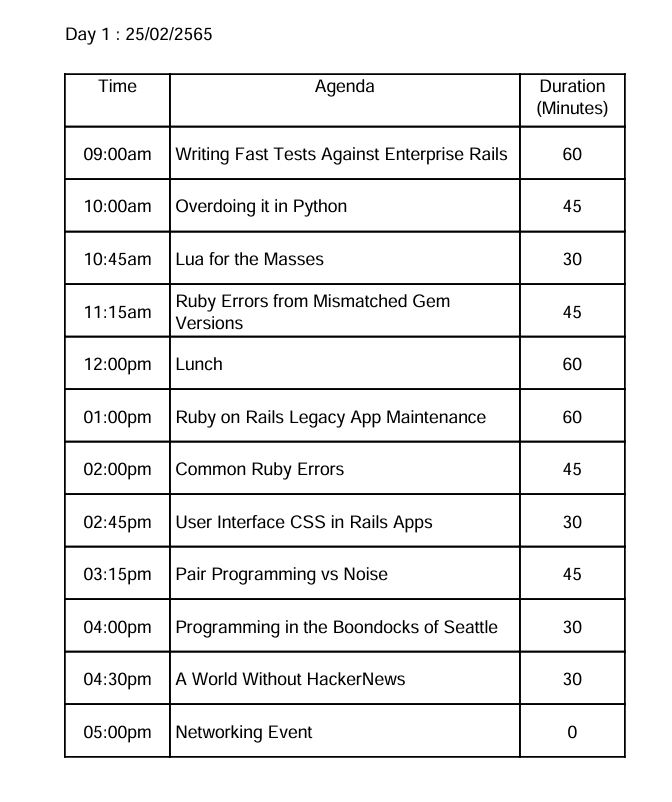
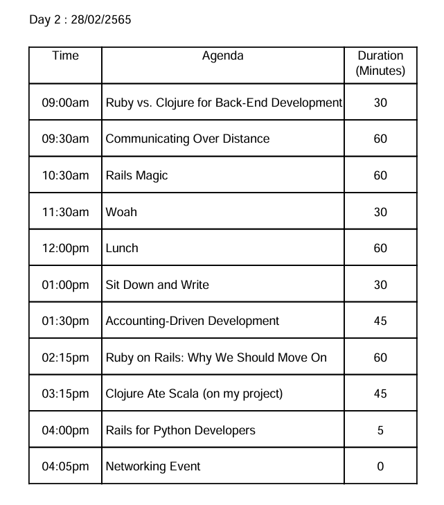

# 📅 ระบบจัดการหัวข้อสัมมนา

โปรแกรม **Seminar Scheduler** เป็นระบบที่ช่วยจัดตารางสัมมนาโดยอัตโนมัติ โดยแบ่งหัวข้อออกเป็นช่วงเช้าและช่วงบ่าย ตามข้อจำกัดของเวลา โปรแกรมจะอ่านข้อมูลจาก ไฟล์ข้อความ (text file) โดยการใส่ Path ของไฟล์และสร้างตารางสัมมนาที่เหมาะสม

---

## 🚀 **คุณสมบัติของโปรแกรม**
- จัดหัวข้อสัมมนาให้เหมาะสมกับ **ช่วงเช้าและช่วงบ่าย** โดยอัตโนมัติ
- จะจัดหัวข้อให้ได้ 04.00pm ก่อนแล้วจะเอาวันที่ไม่ถึงหรือเกินมาเติม
---
# 📥 **รูปแบบไฟล์อินพุต (Input)**
ไฟล์ที่ใช้เป็น .txt โดยต้องมีโครงสร้างดังนี้:
```
YYYY-MM-DD
ชื่อหัวข้อสัมมนา 60min
ช่อหัวข้อสัมมนา 45min
ชื่อหัวข้อสัมมนา 30min
```
---
# วิธีใช้งาน Rest API ตัวที่ 1
- api url http://localhost:8080/api/reports/upload
- upload file .txt
- ระบบจะจัดตารางสัมมนาและแสดงผลเป็น json กลับมา

ตัวอย่าง input
````
2022-02-25
Writing Fast Tests Against Enterprise Rails 60min
Overdoing it in Python 45min
Lua for the Masses 30min
Ruby Errors from Mismatched Gem Versions 45min
Ruby on Rails Legacy App Maintenance 60min
Common Ruby Errors 45min
User Interface CSS in Rails Apps 30min
Pair Programming vs Noise 45min
Ruby vs. Clojure for Back-End Development 30min
Communicating Over Distance 60min
Rails Magic 60min
Woah 30min
Sit Down and Write 30min
Accounting-Driven Development 45min
Ruby on Rails: Why We Should Move On 60min
Clojure Ate Scala (on my project) 45min
Programming in the Boondocks of Seattle 30min
A World Without HackerNews 30min
Rails for Python Developers 5min
````
ตัวอย่าง output
````
[
  {
    "date": "Day 1 : 25/02/2565",
    "seminarTopic": [
      {
        "title": "Writing Fast Tests Against Enterprise Rails",
        "duration": 60,
        "time": "09:00am"
      },
      {
        "title": "Overdoing it in Python",
        "duration": 45,
        "time": "10:00am"
      },
      {
        "title": "Lua for the Masses",
        "duration": 30,
        "time": "10:45am"
      },
      {
        "title": "Ruby Errors from Mismatched Gem Versions",
        "duration": 45,
        "time": "11:15am"
      },
      {
        "title": "Lunch",
        "duration": 60,
        "time": "12:00pm"
      },
      {
        "title": "Ruby on Rails Legacy App Maintenance",
        "duration": 60,
        "time": "01:00pm"
      },
      {
        "title": "Common Ruby Errors",
        "duration": 45,
        "time": "02:00pm"
      },
      {
        "title": "User Interface CSS in Rails Apps",
        "duration": 30,
        "time": "02:45pm"
      },
      {
        "title": "Pair Programming vs Noise",
        "duration": 45,
        "time": "03:15pm"
      },
      {
        "title": "Programming in the Boondocks of Seattle",
        "duration": 30,
        "time": "04:00pm"
      },
      {
        "title": "A World Without HackerNews",
        "duration": 30,
        "time": "04:30pm"
      },
      {
        "title": "Networking Event",
        "duration": 0,
        "time": "05:00pm"
      }
    ]
  },
  {
    "date": "Day 2 : 28/02/2565",
    "seminarTopic": [
      {
        "title": "Ruby vs. Clojure for Back-End Development",
        "duration": 30,
        "time": "09:00am"
      },
      {
        "title": "Communicating Over Distance",
        "duration": 60,
        "time": "09:30am"
      },
      {
        "title": "Rails Magic",
        "duration": 60,
        "time": "10:30am"
      },
      {
        "title": "Woah",
        "duration": 30,
        "time": "11:30am"
      },
      {
        "title": "Lunch",
        "duration": 60,
        "time": "12:00pm"
      },
      {
        "title": "Sit Down and Write",
        "duration": 30,
        "time": "01:00pm"
      },
      {
        "title": "Accounting-Driven Development",
        "duration": 45,
        "time": "01:30pm"
      },
      {
        "title": "Ruby on Rails: Why We Should Move On",
        "duration": 60,
        "time": "02:15pm"
      },
      {
        "title": "Clojure Ate Scala (on my project)",
        "duration": 45,
        "time": "03:15pm"
      },
      {
        "title": "Rails for Python Developers",
        "duration": 5,
        "time": "04:00pm"
      },
      {
        "title": "Networking Event",
        "duration": 0,
        "time": "04:05pm"
      }
    ]
  }
]
````
---
# วิธีใช้งาน Rest API ตัวที่ 2
- api url http://localhost:8080/api/reports/upload
- upload file .txt
- ระบบจะจัดตารางสัมมนาและแสดงผลเป็น json กลับมา

ตัวอย่าง input
````
[
    {"date": "2022-02-25"},
    {"title": "Writing Fast Tests Against Enterprise Rails 60min"},
    {"title": "Overdoing it in Python 45min"},
    {"title": "Lua for the Masses 30min"},
    {"title": "Ruby Errors from Mismatched Gem Versions 45min"},
    {"title": "Ruby on Rails Legacy App Maintenance 60min"},
    {"title": "Common Ruby Errors 45min"},
    {"title": "User Interface CSS in Rails Apps 30min"},
    {"title": "Pair Programming vs Noise 45min"},
    {"title": "Ruby vs. Clojure for Back-End Development 30min"},
    {"title": "Communicating Over Distance 60min"},
    {"title": "Rails Magic 60min"},
    {"title": "Woah 30min"},
    {"title": "Sit Down and Write 30min"},
    {"title": "Accounting-Driven Development 45min"},
    {"title": "Ruby on Rails: Why We Should Move On 60min"},
    {"title": "Clojure Ate Scala (on my project) 45min"},
    {"title": "Programming in the Boondocks of Seattle 30min"},
    {"title": "A World Without HackerNews 30min"},
    {"title": "Rails for Python Developers 5min"}

````
ระบบจัด return PDF ไฟล์กลับมาให้ดาวโหลด

